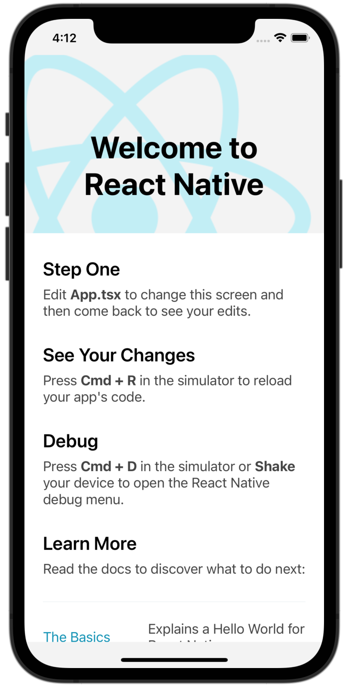
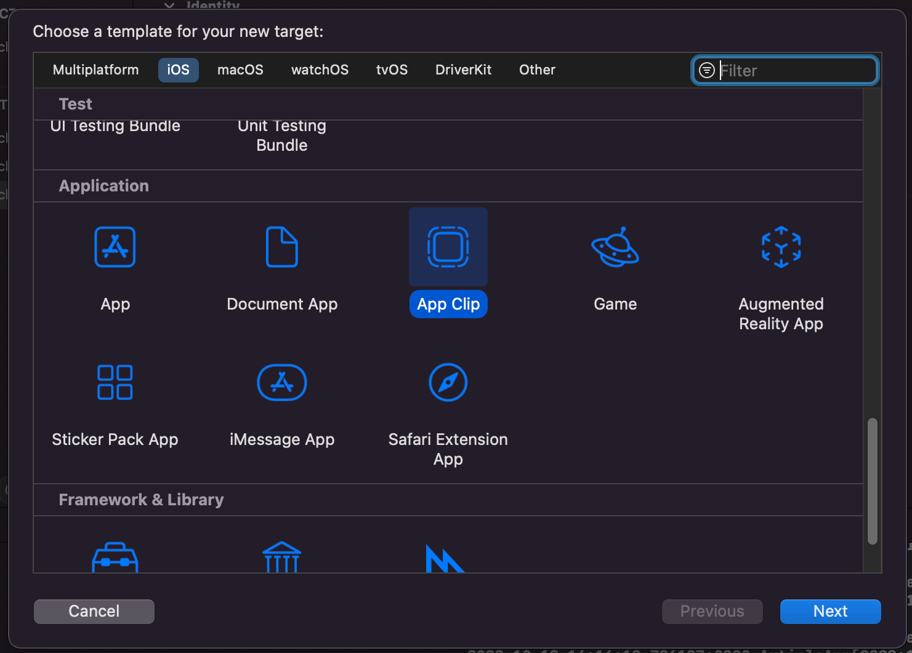
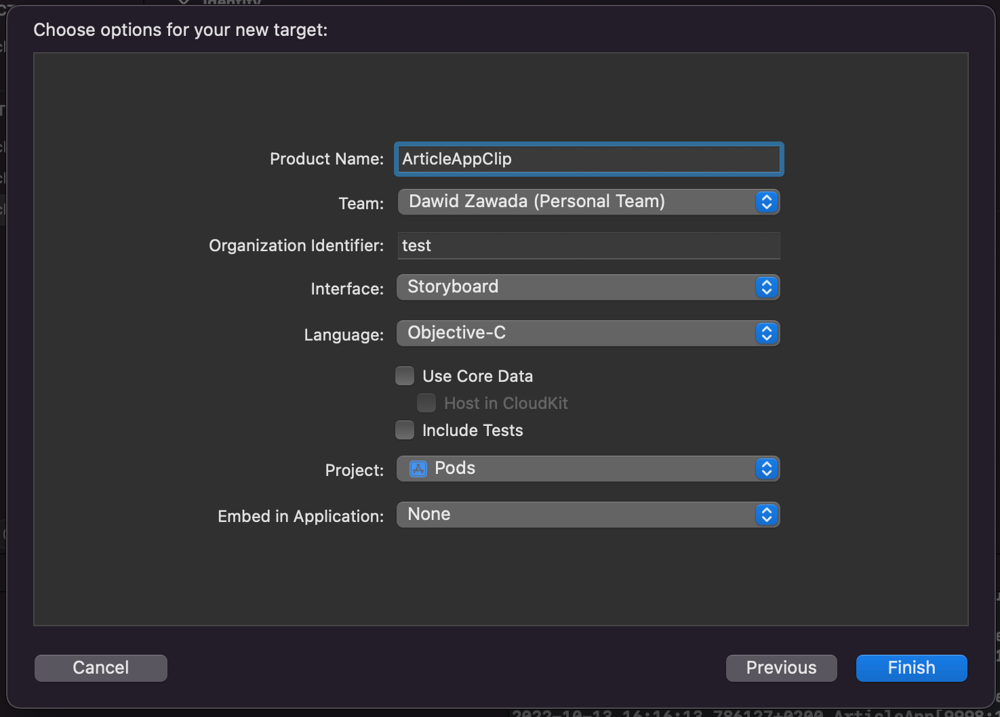
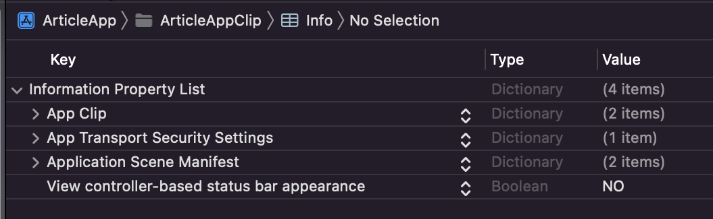
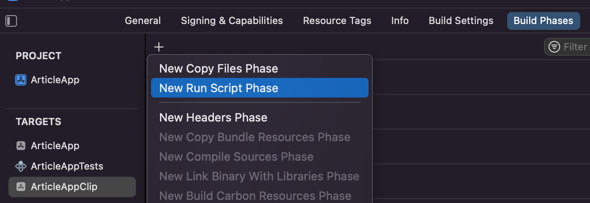

# How to create a React Native App Clip?


AppClip can be created with just a few clicks, but first of all, the React Native project must be created. The first step would be to do a React Native environment set-up for Mac & iOS: [⚛️ Setting up the development environment](https://reactnative.dev/docs/environment-setup) I’m using the current, latest version of Xcode: `13.4.1`.

This article's code is written in the `0.70.3` version of React Native. Versions `0.70`, `0.69`, and `0.68` brought a few changes to the RN's AppClip set-up, so it might be different to other articles about AppClips.

I'm also using an M1 Mac.

Alright, let’s get started. I’m going to initialise the React Native project with TypeScript for article purposes, but it is not required for App Clip to work properly:

```
npx react-native init AwesomeTSProject --template react-native-template-typescript
```

**TIP: In order to create specific version RN project with typescript we need to specify version of React Native as well as fitting typescript template version -** [**Fitting Template Table**](https://github.com/react-native-community/react-native-template-typescript#usage-with-older-versions-of-react-native)**:**

```
npx react-native init ArticleApp --template react-native-template-typescript@6.11 --version 0.69.5
```

Open the project folder, go to the ios folder, and run this command:

```
pod install
```

Open **Xcode** and open the project by choosing the `*.xcworkspace` file located in the `ios` folder.

Choose the simulator and press the play button. A fresh React Native app should be loaded on the simulator. Awesome!



It is now time to create an App Clip target. It is pretty straightforward - stop the simulator, close the Metro process. From the **Xcode** menu, choose `File -> New -> Target` and choose **App Clip**. This target type can be found under the **Application** section or by using the search option.



For the AppClip target, choose the **Storyboard** Interface select and **Objective-C** as the language. Embed the AppClip in your React Native application. Now, a new target should be created in the `ios` folder, it is time to add **React Native** to your project.



Open Podfile located in the `ios` folder, for now you can copy Tests target Pods definition and enter target name.

```
  target 'ArticleAppTests' do
    inherit! :complete
    # Pods for testing
  end
  
  target 'ArticleAppClip' do
    inherit! :complete
  end
```

Save Podfile changes, go to `ios` folder and run again:

```
pod install
```

Alright, now it is time to add some **Objective-C** code for loading & running our React Native **Javascript** code into our App Clip. We will be basing our code on [Integration with Existing Apps](https://reactnative.dev/docs/integration-with-existing-apps) React Native Article.

Open the AppClip target folder - I recommend using **Xcode** for exiting native application code - find the `ViewController.m` file - it should be created automatically by **Xcode.** Add the **loadView** function to the **ViewController** class:

```
#import "ViewController.h"
#import <React/RCTBundleURLProvider.h>
#import <React/RCTRootView.h>

@interface ViewController ()

@end

@implementation ViewController

- (void)loadView {
  #if DEBUG
  // For DEBUG configuration, javascript will be loaded from index file
  NSURL *jsCodeLocation = [[RCTBundleURLProvider sharedSettings]
jsBundleURLForBundleRoot:@"index"];
  #else
  // For RELEASE configuration, js code is bundled and main.jsbundle file is created
  NSURL *jsCodeLocation = [[NSBundle mainBundle]
URLForResource:@"main" withExtension:@"jsbundle"];
  #endif

  // Value of moduleName should be equal to appName value set in index file
  RCTRootView *rootView = [[RCTRootView alloc]
initWithBundleURL:jsCodeLocation moduleName:@"ArticleApp"
initialProperties:nil launchOptions:nil];
  rootView.backgroundColor = [[UIColor alloc] initWithRed:1.0f
green:1.0f blue:1.0f alpha:1];
  self.view = rootView;
}

- (void)viewDidLoad {
    [super viewDidLoad];
}

@end
```

A few things are happening in the code above. When App Clip is run in debug configuration, **Javascript** is loaded from the `index.js` file, located in your project main folder. The file is being exposed at `localhost` by the **Metro bundler** at port `8081`. When configuration is set to release, the `main.jsbundle` file is created with bundled **Javascript** code and loaded into the native code.

The next step would be to add a few keys to App Clip `Info.plist` file, the same keys are being set for your "full" React Native App. Add them at the end, inside the main `</dict>` tag:

```
<key>NSAppTransportSecurity</key>
<dict>
    <key>NSExceptionDomains</key>
    <dict>
        <key>localhost</key>
        <dict>
            <key>NSExceptionAllowsInsecureHTTPLoads</key>
            <true/>
        </dict>
    </dict>
</dict>
<key>UIViewControllerBasedStatusBarAppearance</key>
<false/>
```

Otherwise, you can switch to Xcode’s "Property List" view - `Open As -> Property List` and copy the "**App Transport Security Settings**" and "**View controller-based status bar appearance**" keys.



Your main React Native app has a few build phases. The same build phases need to be copied into your App Clip. To get started, open Build Phases for your main app and find the "**Start Packager**" phase. Copy the script inside. Then, in your App Clip Build Phases, select **New Run Script Phase**, paste copied code, and rename phase to "**Start Packager**".




Now it is time to add the build phase for bundling our JavaScript React Native code. Open the phases of the main app and copy the code from the "**Bundle React Native code and images**" phase. This code changed in recent RN updates - so this article might differ from older React Native App Clips articles. Currently, this code looks like this:

```
set -e

WITH_ENVIRONMENT="../node_modules/react-native/scripts/xcode/with-environment.sh"
REACT_NATIVE_XCODE="../node_modules/react-native/scripts/react-native-xcode.sh"

/bin/sh -c "$WITH_ENVIRONMENT $REACT_NATIVE_XCODE"
```

Basically, this code takes the chosen node version and runs a code compiling script for our JavaScript. **Copy** code from the main application phase, and create a new phase for your AppClip with the same name. **Make sure** to also copy the Input files section of the phase. For me, they look like this:

```
$(SRCROOT)/.xcode.env.local
$(SRCROOT)/.xcode.env
```

**Update 0.69.6 brought a new bug that throws an `[AppDelegate window]: unrecognized selector sent to instance` error when we are trying to load React Native code.** 

I’ve reported the issue, and I’ve got a response from the community. A solution to load React Native into an empty iOS app is to add the following code to App Clip’s `AppDelegate.h`:

```
#import <React/RCTBridgeDelegate.h>
#import <UIKit/UIKit.h>

@interface AppDelegate : UIResponder <UIApplicationDelegate, RCTBridgeDelegate>

@property (nonatomic, strong) UIWindow *window;

@end
```

This code will fix the issue, and your React Native App should be loaded without any errors. I’ve tested this on both versions `0.69.6` and `0.70.3`, which is currently the latest one.

And now, basically most of the work is done. Run your App Clip and you should see the React Native App from your newly created main app.

Of course, it’s not our goal to have the same app in our main app and App Clip. In order to have separated RN Apps, go to the `ViewController.m` file of our App Clip again, find line:

```
NSURL *jsCodeLocation = [[RCTBundleURLProvider sharedSettings] jsBundleURLForBundleRoot:@"index"];
```

And change it to:

```
NSURL *jsCodeLocation = [[RCTBundleURLProvider sharedSettings] jsBundleURLForBundleRoot:@"index.clip"];
```

Now we are telling our bundle script to look for the `index.clip.js` file instead of `index.js`. The next step would be to comeback to our App Clip "**Bundle React Native code and images**" build phase and change code to:

```
set -e

WITH_ENVIRONMENT="../node_modules/react-native/scripts/xcode/with-environment.sh"
REACT_NATIVE_XCODE="../node_modules/react-native/scripts/react-native-xcode.sh"

/bin/sh -c "$WITH_ENVIRONMENT $REACT_NATIVE_XCODE index.clip.js"
```

The script will do exactly the same thing - bundle our **JavaScript** code, but instead of looking for `index.js` located in our main application code, the script will take the `index.clip.js` file and create bundled code. The last step of creating a separated app is going to the root application folder and creating a new file called `index.clip.js` next to the `index.js` file with the paste code below:

```
/**
 * @format
 */

import React from 'react';
import {AppRegistry, View, Text} from 'react-native';
import {name as appName} from './app.json';

const AppClip = () => (
  <View
    style={{
      justifyContent: 'center',
      alignItems: 'center',
      marginTop: 50,
    }}>
    <Text
      style={{
        fontSize: 40,
        margin: 10,
        textAlign: 'center',
      }}>
      Hello,
    </Text>
    <Text
      style={{
        fontSize: 20,
        margin: 10,
        textAlign: 'center',
      }}>
      I'm your AppClip!
    </Text>
  </View>
);

AppRegistry.registerComponent(appName, () => AppClip);
```

And that’s it. Now we are running a React Native App from a separated `index` file - with that code is shared shared but content can be changed between main app and App Clip.

Next steps:

[How to create a React Native Instant App?](Creating-React-Native-InstantApp.md)

[Handling size of React Native App Clip](Handling-Size-React-Native-AppClip.md)