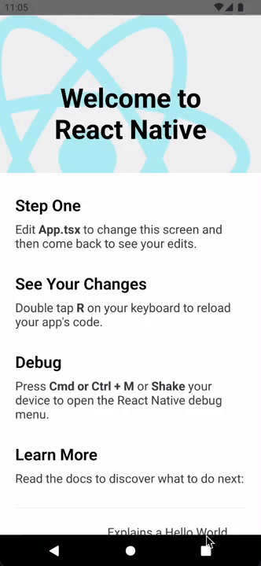

# How to create a React Native Instant App?


Android **Instant Apps** can also be created with React Native. Creating them would require more than just a few clicks when we compare them with iOS App Clips but Instant Apps are much more similar to standard Android Apps, so creating them is the trickiest part. 

Alright, let’s get started - the first step would be to do a React Native environment set-up for Android and MacOS(in my case): [⚛️ Setting up the development environment](https://reactnative.dev/docs/environment-setup).

A few notes from my side about preparing the environment:

-   At the time of writing this article, I’m using **Android SDK API Level 31**. Level 32 is not compatible with all RN packages yet - make sure to verify this in your project.

-   I’m not using **Node 17**.

-   Install additional Instant App tools for your SDK(lvl 31 in my case) - `SDK Tools -> Install Google Play Instant Development SDK`.

-   Make sure to have the following exports in your terminal shell(I’m using zsh):


```
export ANDROID_SDK_ROOT=$HOME/Library/Android/sdk
export PATH=$PATH:$ANDROID_SDK_ROOT/emulator
export PATH=$PATH:$ANDROID_SDK_ROOT/platform-tools
export PATH=$ANDROID_SDK_ROOT/extras/google/instantapps:$PATH
```

Alright, let’s create a new React Native project. I’m going to initialise the React Native project with **TypeScript** for article purposes, but it is not required for **Instant App** to work correctly:

```
npx react-native init ArticleApp --template react-native-template-typescript
```

After installing the project, **DO NOT OPEN IT IN ANDROID STUDIO YET**. Instead, go to the project directory, open `android`, and copy the `app` folder and paste it next to the original one, renaming the copied `app` folder to `appInstant`. Then, open the `settings.gradle` file and find the line:

```
include ':app'
```

And add `appInstant` next to the `app`, it should look like this:

```
rootProject.name = 'ArticleApp'
apply from: file("../node_modules/@react-native-community/cli-platform-android/native_modules.gradle"); applyNativeModulesSettingsGradle(settings)
include ':app', ':appInstant'
includeBuild('../node_modules/react-native-gradle-plugin')
// ...
```

Alright, now open the android folder with **Android Studio**. You should see 2 modules(in Android View). Copying the **app** module that way ensures that we have two React Native apps with the **same** configuration. Now we can test the **Main App module**. Add a simulator and run the `yarn android` command. A newly created Android app should be loaded into the simulator. But how to run our **appInstant module**? To test if our newly created module works, create a new folder called `scripts` - and create a new bash script file called `build_run_instant_app.bash` and paste the code below inside:

```
#!/bin/bash

set -e

adb uninstall com.articleapp || true

sh scripts/cleanup.bash
./gradlew clean

./gradlew appInstant:bundleRelease

bundletool build-apks --bundle=appInstant/build/outputs/bundle/release/appInstant-release.aab  --output=local_app.apks --connected-device --ks=debug.keystore --ks-pass=pass:12345678 --ks-key-alias=key0 --key-pass=pass:12345678

bundletool install-apks --apks local_app.apks

adb shell am start -n com.articleapp/com.articleapp.MainActivity
```

Notice that the script is also running another script called `cleanup.bash` - create it next to the previous script, here’s what it should look like:

```
#!/bin/bash

# Set the apks_file
apks_file='local_app.apks'
exported_apks_dir='testing_locally'

# Check the file is exists or not
if [ -f $apks_file ]; then rm "$apks_file" ; fi
if [ -d $exported_apks_dir ]; then rm -rf "$exported_apks_dir" ; fi
```

**TIP: You might encounter an error "permissions denied" when running one of the scripts. To fix this issue, set the following command for every script file:**

```
chmod 755 <script name>.bash 
```

Alright, the script is ready to run our **appInstant module**. If you take a closer look at the script, you might notice that the `bundletool` command takes the `debug.keystore` file from the main `android` directory as the keystore. This file does not exist yet, hence we need to create it with the following command:

```
sudo keytool -genkey -v -keystore debug.keystore -alias key0 -keyalg RSA -keysize 2048 -validity 10000
```

Notice that the script is using `12345678` as a password. If you want, you can change it, otherwise provide this password when the command asks for it.

You can also consider using the keystore generated by the **React Native CLI**.

Alright - now we’re ready to launch our new nodule, turn on **android simulator**, and run our bash script:

```
./scripts/build_run_instant_app.bash
```


And that’s it! Our new module with React Native works - but it is not an Instant App yet. Time to change that!

To turn **App** into **Instant App** go to our **appInstant module** and open `build.gradle` file, find the `enableProguardInReleaseBuilds` variable and set it to **true.** This will reduce the size of the **Instant App** bundle(it is key to make it as low as it can possibly be).

```
//...

/**
 * Run Proguard to shrink the Java bytecode in release builds.
 */
def enableProguardInReleaseBuilds = true

//...
```

According to [📖 Android Docs](https://developer.android.com/topic/google-play-instant/getting-started/instant-enabled-app-bundle#configure), the next step is to include the Instant App dependency in the `build.gradle`, it should look like this:

```
implementation "com.google.android.gms:play-services-instantapps:18.0.1"
```

I’ve added this dependency above the React Native one, like so:

```
dependencies {
    implementation fileTree(dir: "libs", include: ["*.jar"])

    //noinspection GradleDynamicVersion
    implementation 'com.google.android.gms:play-services-instantapps:18.0.1'
    implementation "com.facebook.react:react-native:+"  // From node_modules

    implementation "androidx.swiperefreshlayout:swiperefreshlayout:1.0.0"
    debugImplementation("com.facebook.flipper:flipper:${FLIPPER_VERSION}") {
        exclude group:'com.facebook.fbjni'
    }
    // ...
}
```

The last thing to change in the `build.gradle` file is to choose a way of setting up `versionCode` for the **Main App** and **Instant** one. Basically, the Play Store requires the **Main App** to always have a higher `versionCode` than the **Instant App** for each release.

[📖 Android docs recommend](https://developer.android.com/topic/google-play-instant/getting-started/instant-enabled-app-bundle#version-codes) the approach of setting a very high `versionCode` for the **Main App** - like 1000, and for **Instant App** starting from 1 and incrementing both values for each update. Personally, I think a better solution is to start from `versionCode` equal to **1** for **Instant App,** and for **Main App** start with `versionCode` equal to **2**, for each release, both values should be incremented by **2**, like this:

```
Main App versionCode = 2 -> versionCode = 4
Instant App versionCode = 1 -> versionCode = 3

Main App versionCode = 42 -> versionCode = 44
Instant App versionCode = 41  -> versionCode = 43
```

With that solution, we’ve got an infinite pool of numbers. Choose a solution that works best for you.

Next, we need to adjust the manifest file. Your Instant App's `AndroidManifest.xml` file needs to be updated with the proper target sandbox environment version that **Google Play Instant** supports.

You can complete this update by adding the `android:targetSandboxVersion` attribute to your app's `<manifest>` element, as shown in the following code snippet:

```
<manifest
   xmlns:android="http://schemas.android.com/apk/res/android"
  ...
   android:targetSandboxVersion="2" ...>
```

The last thing to do in the manifest is to enable **Instant Apps Support**. Unlike changing `targetSandboxVersion`, this can be done from the Android Studio GUI. Right-click on your **Main App** module - named app and choose `Refactor -> Enable Instant Apps Support`. In the dialog, choose your **Main App** and click `OK`. Do the same for the **Instant App** module but choose `appInstant` in the dialog. Both module manifests should have added the following declaration:

```
<manifest ... xmlns:dist="http://schemas.android.com/apk/distribution">
    <dist:module dist:instant="true" />
    ...
</manifest>
```

You can also do this manually by pasting the code from the snippet into the manifests.

The next file that needs to be modified is `MainApplication.java` of the Instant App located at `android/appInstant/src/main/java/com/articleapp/`. The first change is to add a new import at the top of the file:

```
import com.google.android.gms.instantapps.InstantApps;
```

The last change(for now!) is to add the following function at the end of the **MainApplication** class:

```
private boolean isInstant() {
        return InstantApps.getPackageManagerCompat(MainApplication.this).isInstantApp();
    }
```

This function might be helpful in the future. It basically checks if we’re running an instant app.

And that’s it. Our **appInstant module** now aggregates **Instant Experience** features. The last step is to modify the `build_run_instant_app.bash` script to support Instant Apps:

```
#!/bin/bash

set -e

adb uninstall com.articleapp || true

# clean
sh scripts/cleanup.bash
./gradlew clean

# build bundle
./gradlew appInstant:bundleRelease

# build apks file from bundle based on connected device configuration
bundletool build-apks --bundle=appInstant/build/outputs/bundle/release/appInstant-release.aab --output=local_app.apks --connected-device --ks=debug.keystore --ks-pass=pass:12345678 --ks-key-alias=key0 --key-pass=pass:12345678

# unzipping apks file to testing dir
unzip local_app.apks -d testing_locally

# run instant app from specific split /
ia --debug run testing_locally/instant/*.apk
```

Now it is time to run our instant app. In **Android Studio**, prepare the simulator (or even your actual device) and run the script again.

```
./scripts/build_run_instant_app.bash
```




Yaay! Our Instant App works! We’re running our React Native App and if we take a closer look at the Android App Information, our app is indeed an **Instant App**.

Of course, just like in the App Clip case, we do not want to run the same code for Instant App and Main App - time to split index files!

Let’s start by going to the root application folder and creating a new file called `index.instant.js` next to the index.js file, with the paste code below:

```
/**
 * @format
 */

import React from 'react';
import {AppRegistry, View, Text} from 'react-native';
import {name as appName} from './app.json';

const InstantApp = () => (
  <View
    style={{
      justifyContent: 'center',
      alignItems: 'center',
      marginTop: 50,
    }}>
    <Text
      style={{
        fontSize: 40,
        margin: 10,
        textAlign: 'center',
      }}>
      Hello,
    </Text>
    <Text
      style={{
        fontSize: 20,
        margin: 10,
        textAlign: 'center',
      }}>
      I'm your Instant App!
    </Text>
  </View>
);

AppRegistry.registerComponent(appName, () => InstantApp);
```

Next, open appInstant’s `build.gradle` file - and find the `project.ext.react` variable and set up like this:

```
project.ext.react = [
        enableHermes: true,  // clean and rebuild if changing
        entryFile      : "index.instant.js",
        bundleAssetName: "index.instant.bundle",
]
```

Basically, we are telling the React Native environment to take `index.instant.js` and create an `index.instant.bundle` file with bundled **Javascript** code.

Now it is time to modify `MainApplication.java` find an Override named `getJSMainModuleName` and paste another **Override** next to it:

```
@Override
protected String getBundleAssetName() {
    return "index.instant.bundle";
}
```

For me it looks like this:

```
    private final ReactNativeHost mReactNativeHost =
            new ReactNativeHost(this) {
	          // ...

                @Override
                protected String getJSMainModuleName() {
                    return "index";
                }

                @Override
                protected String getBundleAssetName() {
                    return "index.instant.bundle";
                }

                // ...
            };
```


That’s it! Run the `build_run_instant_app.bash` script - Instant App has a separate `index` file, but components, functions, etc. from the Main App can be used inside of the Instant App since code is shared between these two.

It works!

Next steps:

[Handling size of React Native App Clip](Handling-Size-React-Native-AppClip.md)

[Handling size of React Native Instant App](Handling-Size-React-Native-InstantApp.md)