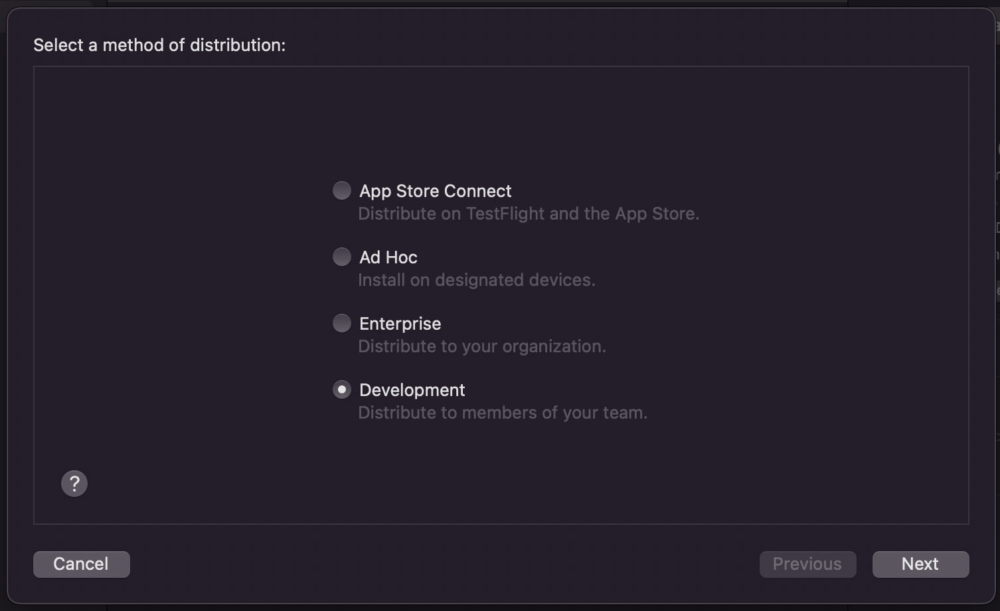
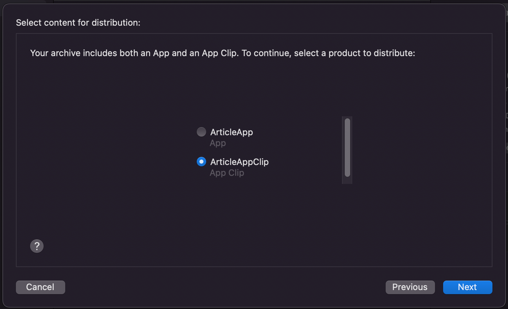
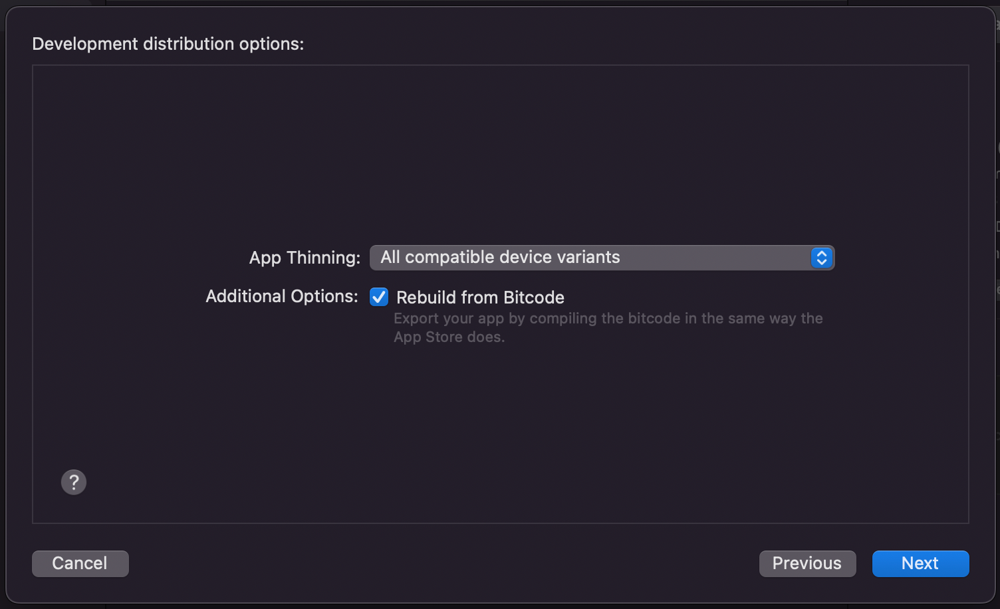
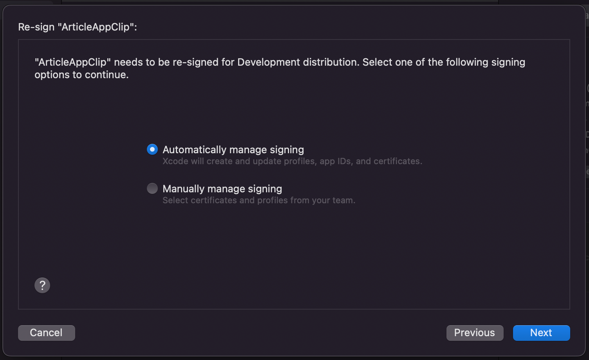

# Handling size of React Native App Clip

Apple limits the size of App Clips to **10MB** or **15MB** before compression - that’s not a lot for React Native based iOS applications - let’s measure the size of the newly created App Clip to see how much space it takes.

First, let’s archive the "Full" App target - to do that we need to set up a few things:

-   Set bundle identifier of "**Full App**" to the chosen **bundle ID**(you might even create an App ID & Provisioning profile on Apple Developer) - for my article project it will be: `com.codibly.articleapp`

-   Set bundle identifier for **App Clip** based on parent app - in my case it will be: `com.codibly.articleapp.clip`

-   Select the same device support settings for Full App & App Clips - eg. iPhone or iPhone & iPad

-   Find the entitlements file of your App Clip target - called `ArticleAppClip.entitlements` in my case - and update the value of `com.apple.developer.parent-application-identifiers` key to the new bundle identifier of the parent app. For me, it looks like this: `$(AppIdentifierPrefix)com.codibly.articleapp`


Now we are ready to archive our app. Choose Full App target but instead of the iPhone simulator, choose the "**Any iOS Device (arm64)**" option. Then choose `Product -> Archive`.

After successful archiving, the "**Organiser**" window should be shown with the new archive listed on top - select it and press the **Distribute App** button. Then, choose the **Development** option.



Then, choose our **App Clip** target.



Choose the "**All compatible device variants**" option.



And “**Automatically manage signing**”, the next step should start loading the exporting window of App Clip.



After the re-signing process, export App Clip to the chosen location and open the folder in Finder.

Open `App Thinning Size Report.txt` file. At the end of the file should contain a line with information about the **compressed** & **uncompressed** size of the application. For my clean React Native project, it looks like this:

```
App + On Demand Resources size: 1,2 MB compressed, 3,4 MB uncompressed
```

The uncompressed size of the React Native app is `3.4 MB`. It definitely fits under the App Clip uncompressed bundle **10 MB** / **15 MB** size limit. Unfortunately, if we would like to add new npm packages which use native code and use it only in components imported into our Main App `index` file - the size of the App Clip would increase anyway.

It’s because of a feature introduced in **React Native 0.60** - **auto-linking**. Remember that we've set our App Clip target to inherit all Pods(native packages) of the Full App - this helped us to get the React Native packages we needed, but during the development of the "**Full**" app we would not benefit from inheriting all packages. What we can do is include in App Clip only those pods which will be used in App Clip.

Luckily, the React Native team listed them all in the "[🚀 Integration with Existing Apps](https://reactnative.dev/docs/integration-with-existing-apps#configuring-cocoapods-dependencies)" article. The names and paths are a little bit outdated. I’ve updated them and listed them all below. The only thing left is to move the App Clip Target pod definitions outside of the "Full" app scope and list the pods required by React Native:

```
target 'ArticleApp' do
  ...
end

target 'ArticleAppClip' do
    pod 'FBLazyVector', :path => "../node_modules/react-native/Libraries/FBLazyVector"
    pod 'FBReactNativeSpec', :path => "../node_modules/react-native/React/FBReactNativeSpec"
    pod 'RCTRequired', :path => "../node_modules/react-native/Libraries/RCTRequired"
    pod 'RCTTypeSafety', :path => "../node_modules/react-native/Libraries/TypeSafety"
    pod 'React', :path => "../node_modules/react-native/"
    pod 'React-Core', :path => "../node_modules/react-native/"
    pod 'React-CoreModules', :path => "../node_modules/react-native/React/CoreModules"
    pod 'React-RCTActionSheet', :path => "../node_modules/react-native/Libraries/ActionSheetIOS"
    pod 'React-RCTAnimation', :path => "../node_modules/react-native/Libraries/NativeAnimation"
    pod 'React-RCTBlob', :path => "../node_modules/react-native/Libraries/Blob"
    pod 'React-RCTImage', :path => "../node_modules/react-native/Libraries/Image"
    pod 'React-RCTLinking', :path => "../node_modules/react-native/Libraries/LinkingIOS"
    pod 'React-RCTNetwork', :path => "../node_modules/react-native/Libraries/Network"
    pod 'React-RCTSettings', :path => "../node_modules/react-native/Libraries/Settings"
    pod 'React-RCTText', :path => "../node_modules/react-native/Libraries/Text"
    pod 'React-RCTVibration', :path => "../node_modules/react-native/Libraries/Vibration"
    pod 'React-Core/RCTWebSocket', :path => "../node_modules/react-native/"

    pod 'React-cxxreact', :path => '../node_modules/react-native/ReactCommon/cxxreact'
    pod 'React-jsi', :path => '../node_modules/react-native/ReactCommon/jsi'
    pod 'React-jsiexecutor', :path => '../node_modules/react-native/ReactCommon/jsiexecutor'
    pod 'React-callinvoker', :path => "../node_modules/react-native/ReactCommon/callinvoker"
    # Use when hermes is enabled
    pod 'React-hermes', :path => "../node_modules/react-native/ReactCommon/hermes"
end
```

**WARNING: If you will encounter an error** `Undefined symbols for architecture x86_64: "vtable for facebook::react::HermesExecutorFactory"` **make sure you are using** `pod 'React-hermes'` **listed at the end of the App Clip target pods list. Since version** `0.70`, **Hermes is used as the default engine, so it needs to be linked.**

Save the new pod definition and run the `pod install` command in the `ios` folder once again. In the event of any error, run `pod deintegrate` and `pod install` again.

Archive project once again, here’s my size score after adding only the required pods:

```
App + On Demand Resources size: 1,1 MB compressed, 3,1 MB uncompressed
```

Size got reduced a little bit. Now let’s test if adding new native libraries will increase the size of App Clip. Run the following console in the root project folder:

```
yarn add @react-native-firebase/app@^14.12.0 @react-native-firebase/messaging@^14.12.0
```

I’m using version 14 of `react-native-firebase` because version 15 was returning some errors for my version of react native.

**WARNING: The libraries above are used only as an example. If you want to use them in your JS code or you will encounter any kind of error, make sure that you follow all the installation steps from** [**RN Firebase Docs**](https://rnfirebase.io/#installation)**.**

Then go to the `ios` folder and run pod install once again. Here's my size report score after adding 2 new native npm packages:

```
App + On Demand Resources size: 1,1 MB compressed, 3,1 MB uncompressed
```

We’ve got it - size did not increase even after adding additional packages to the App Clip. But what if we wanted to use these packages inside App Clip JS code? Let’s declare them inside our **Podfile**:

```
target 'ArticleAppClip' do
    ...
    pod 'RNFBApp', :path => '../node_modules/@react-native-firebase/app'
    pod 'RNFBMessaging', :path => '../node_modules/@react-native-firebase/messaging'
end
```

And that’s it. Run the pod install command and let's archive the app once again to check how much the bundle size will grow. Notice that the name of the import is a little bit different from the npm package name. Import names and instructions for manual linking installation can be found sometimes in libraries documentation - sometimes it's good to look at **README** history before auto-linking was introduced.

Here’s my size score:

```
App + On Demand Resources size: 1,3 MB compressed, 3,9 MB uncompressed
```

The size increased by `0.8 MB` after adding(linking) manually 2 new libraries.

Next steps:

[Linking in App Clip](Linking-AppClip.md)

[Handling size of React Native Instant App](Handling-Size-React-Native-InstantApp.md)

