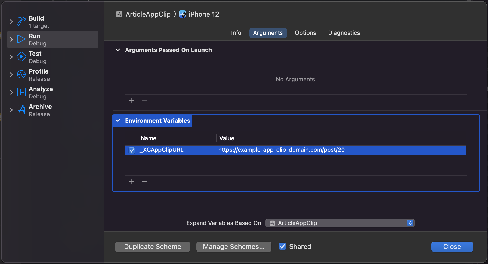
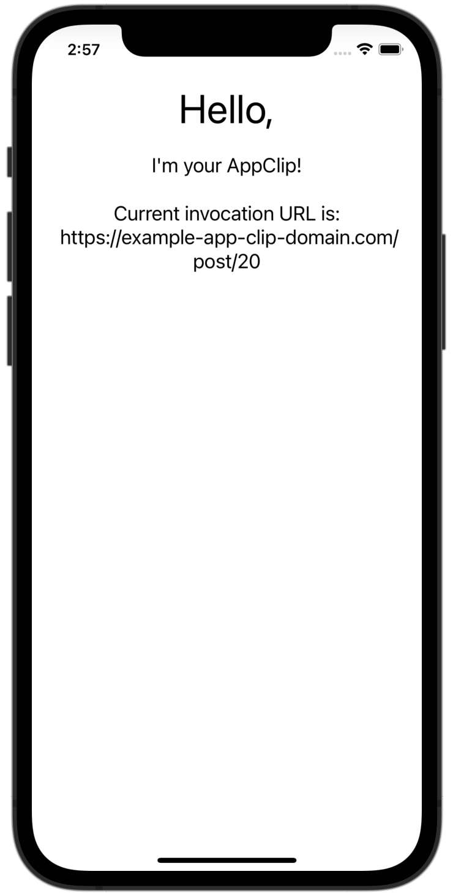

# Linking in App Clip

App Clips are being launched by one of the invocation methods. The most popular ones are **QR codes** with **URLs**. The Clip is receiving an URL - based on which we can configure it to show some specific information on the **App Clip Card**, but also pass some information to the application itself - just like in normal apps with deep links. Unfortunately, the **React Native Linking module** - for a time being is **not supporting** App Clip’s invocation URLs. The solution is pretty straightforward - based on this article - [📎 Handling App Clip URLs](https://mobiledevtutorials.com/handling-app-clip-url-in-react-native/).

To get the initial **invocation URL**, we need to create our **Native Module**. But first of all, let’s try to extract data from native code and log it into the console. The first step would be to prepare a debugging setup for **App Clip** with a predefined **URL**:

1.  Open your App Clip scheme in **Xcode**, select the **Run** action.

2.  Look for the **Arguments** tab, check whether the `_XCAppClipURL` environment variable is present. When you are adding an App Clip target to your project, **Xcode** should add this environment variable. If this variable is missing - add it.

3.  Set the variable value to your test **URL**. Make sure to enable this variable by using the checkbox.

4.  Now you can build and run your **App Clip**.




Now we have our **initial URL** sent to our App Clip. It is time to get access to it from Native Code. Go to the `ios` folder, find your App Clip app and `SceneDelegate.m` file. Find a method called `willConnectToSession` - according to the article, this method is called when your app creates or restores an instance of your user interface.

The code for this method should look like this:

```
- (void)scene:(UIScene *)scene willConnectToSession:(UISceneSession *)session options:(UISceneConnectionOptions *)connectionOptions {
  if (connectionOptions.userActivities && connectionOptions.userActivities.count > 0) {
    NSUserActivity *userActivity = connectionOptions.userActivities.allObjects.firstObject;
     NSLog(@"%@", userActivity.webpageURL.absoluteString);
    self.initialLinkUrl = userActivity.webpageURL.absoluteString;
   }
  
}
```

It is written in **Objective-C**, and don't worry - it is scary only at the beginning. Basically, the `willConnectToSession` method has access to objects with data about user activity - there we can find our **URL**. If it is present, we are logging the URL to the console with the help of `NSLog`:

```
NSLog(@"%@", userActivity.webpageURL.absoluteString);
```

What's more, we're assigning **URL** to Scene's `initialLinkUrl` property. We are accessing Scene object via `self` keyword.

```
self.initialLinkUrl = userActivity.webpageURL.absoluteString;
```

Also, we need to make sure that these 2 properties are implemented in the `SceneDelegate.h` file:

```
#import <UIKit/UIKit.h>

@interface SceneDelegate : UIResponder <UIWindowSceneDelegate>

@property (strong, nonatomic) UIWindow * window;
@property (strong, readwrite) NSString * initialLinkUrl;

@end

```

Alright, time to test if the code works - run **App Clip** once again. The URL from debugging should be logged into the console.

The URL is being logged, but how to pass this URL to React Native to handle it? 

The first answer that comes to a React Native developer's mind is the **Linking Module**, but as it was mentioned above & in the article - it will not work. 

So, we need to create our own module to pass this code to React Native. To do that, we can follow the article author's steps. Let’s create 2 files - `AppClipLinkingManager.h` and `AppClipLinkingManager.m`.

`AppClipLinkingManager.h` file should look like this:

```
#import <React/RCTBridgeModule.h>
#import <React/RCTEventEmitter.h>
#import <Foundation/Foundation.h>

@interface AppClipLinkingManager : RCTEventEmitter <RCTBridgeModule>

@end
```

Basically, we are importing a React Native module for sending events and exporting functions here. You can learn more about **Native Modules** at the RN docs: [⚛️ Native Modules Intro](https://reactnative.dev/docs/native-modules-intro)

Now let’s switch to the other file. The `AppClipLinkingManager.m` file should have this code:

```
#import "AppClipLinkingManager.h"
#import "SceneDelegate.h"

@implementation AppClipLinkingManager

- (dispatch_queue_t)methodQueue
{
  return dispatch_get_main_queue();
}

RCT_EXPORT_MODULE();

- (NSArray<NSString *> *)supportedEvents {
  return @[];
}

RCT_EXPORT_METHOD(getInitialLink:(RCTPromiseResolveBlock) resolve:(RCTPromiseRejectBlock)reject) {
  UIScene *scene =  UIApplication.sharedApplication.connectedScenes.allObjects.firstObject;
  SceneDelegate *sceneDelegate = (SceneDelegate *)scene.delegate;
  
  if (sceneDelegate.initialLinkUrl) {
      resolve(sceneDelegate.initialLinkUrl);
    } else {
      reject(@"event_failure", @"no event id returned", nil);
    }
}
@end
```

Later we will add more code to both, but for now we are basically exporting the `getInitialLink` function from the module to React Native. Alright, since the function is exported - let's use it!

Let’s modify our **App Clip** component a bit - let's create a new file for the `AppClip.tsx` component, and let's fill the component with the code below:

```
import {NativeModules, Text, View} from 'react-native';
import React, {useEffect, useState} from 'react';

const AppClip = () => {
  const {AppClipLinkingManager} = NativeModules;
  const [link, setLink] = useState('');

  useEffect(() => {
    const asyncEffect = async () => {
      const initialLink = (await AppClipLinkingManager.getInitialLink()) || '';
      setLink(initialLink);
    };
    void asyncEffect();
  }, []);

  return (
    <View
      style={{
        justifyContent: 'center',
        alignItems: 'center',
        marginTop: 50,
      }}>
      <Text
        style={{
          fontSize: 40,
          margin: 10,
          textAlign: 'center',
        }}>
        Hello,
      </Text>
      <Text
        style={{
          fontSize: 20,
          margin: 10,
          textAlign: 'center',
        }}>
        I'm your AppClip!
      </Text>
      <Text
        style={{
          textAlign: 'center',
          margin: 14,
          fontSize: 20,
        }}>
        {`Current invocation URL is: \n ${link}`}
      </Text>
    </View>
  );
};

export default AppClip;
```

Then import and use App Clip component inside `index.clip.js`.

```
import AppClip from './AppClip';

AppRegistry.registerComponent(appName, () => AppClip);
```

Now, run the App Clip’s target with our initial URL argument provided.




It is working - we’re passing the initial URL to our **Javascript** code through Native Module.

If you are using Typescript in your RN project, you might want to set types for our native module’s `getInitialLink` function. That can be done by creating a type definition file - let's call it `NativeModules.d.ts` and including it in the `tsconfig.json` file.

```
  "include": [
    "NativeModules.d.ts"
  ]
```

`NativeModules.d.ts` file should look like this:

```
import 'react-native';

export interface AppClipLinkingManager {
  getInitialLink: () => Promise<string>;
}

// and extend them!
declare module 'react-native' {
  interface NativeModulesStatic {
    AppClipLinkingManager: AppClipLinkingManager;
  }
}
```

Now we have a fully-typed, working function for getting the **initial invocation URL** - but what if our App Clip will be minimalized and invoked once again with a new URL? 

Well, our App Clip is already initialized, it’s just loaded from the background, so a **new URL will not be applied**. That’s not behavior we might want. For standard React Native, we could use the **"url"** event of the **Linking module** - but it is not available for App Clip, hence we should create a similar event for our `AppClipLinkingManager` native module.

First, let’s go back to our App Clip’s `SceneDelegate.m` file. Here we are going to implement a new lifecycle method - `continueUserActivity`. Basically, it is called when an app comes back from the background - so when we're **re-invoking** App Clip eg. with a new **QR code**.

The biggest issue is that we need to somehow emit an custom native module event from `continueUserActivity` - that's tricky because we cannot easily access instances of native modules created by React Native. I've found a workaround that helps resolve this issue. We can set a new **URL** with the `NSNotificationCenter` class. Our `continueUserActivity` method should look like this:

```
#import "SceneDelegate.h"

@implementation SceneDelegate

- (void)scene:(UIScene *)scene willConnectToSession:(UISceneSession *)session options:(UISceneConnectionOptions *)connectionOptions {
  //...
}

- (void)scene:(UIScene *)scene continueUserActivity:(NSUserActivity *)userActivity{

  if(userActivity.webpageURL){
    NSString* newURL =[userActivity.webpageURL absoluteString];
    NSDictionary* userInfo = @{@"url": newURL};
    [[NSNotificationCenter defaultCenter] postNotificationName:@"NewURLEvent"
         object:self
         userInfo:userInfo];
  }
}
//...
@end
```

Basically, we’re emitting "**NewURLEvent**" NSNotification when the **URL** is available and we're loading the app from the background. Now is the time to react to the event in our native module. Open the `AppClipLinkingManager.h` file and **declare** the `sendNewUrlEvent` function.

```
#import <React/RCTBridgeModule.h>
#import <React/RCTEventEmitter.h>
#import <Foundation/Foundation.h>

@interface AppClipLinkingManager : RCTEventEmitter <RCTBridgeModule>

- (void)sendNewUrlEvent:(NSString *)eventName;

@end
```

Now we need to add a few methods and properties to the `AppClipLinkingManager.m` file. Basically, I'm following the [⚛️ React Native Native Module documentation](https://reactnative.dev/docs/native-modules-ios#sending-events-to-javascript). Essentially, what we want to do is to listen for "**NewURLEvent**" and then call the `sendNewUrlEvent` function that will emit an event to our **JavaScript** code.

The `AppClipLinkingManager.m` file should look like this:

```
#import "AppClipLinkingManager.h"
#import "SceneDelegate.h"

@implementation AppClipLinkingManager
{
  bool hasListeners;
}

- (instancetype)init
{
    self = [super init];

    [[NSNotificationCenter defaultCenter] addObserver:self
                                             selector:@selector(receivedNewUrlEvent:)
                                                 name:@"NewURLEvent"
                                               object:nil];
    return self;
}

- (void)dealloc
{
    [[NSNotificationCenter defaultCenter] removeObserver:self];
}

+ (BOOL)requiresMainQueueSetup
{
  return NO;
}


- (void)receivedNewUrlEvent:(NSNotification *)notification {
  NSDictionary* userInfo = notification.userInfo;
  NSString* newURL = (NSString*)userInfo[@"url"];
  [self sendNewUrlEvent: newURL];
}

// Emits JS event
- (void)sendNewUrlEvent:(NSString *)newUrl {
  if (hasListeners) {
    NSLog(@"%@", newUrl);
    [self sendEventWithName:@"onNewUrl" body:@{@"url": newUrl}];
  }
}

- (dispatch_queue_t)methodQueue
{
  return dispatch_get_main_queue();
}

// Will be called when this module's first listener is added.
-(void)startObserving {
    hasListeners = YES;
    // Set up any upstream listeners or background tasks as necessary
}

// Will be called when this module's last listener is removed, or on dealloc.
-(void)stopObserving {
    hasListeners = NO;
    // Remove upstream listeners, stop unnecessary background tasks
}

RCT_EXPORT_MODULE();

- (NSArray<NSString *> *)supportedEvents {
  return @[@"onNewUrl"];
}

RCT_EXPORT_METHOD(getInitialLink:(RCTPromiseResolveBlock) resolve:(RCTPromiseRejectBlock)reject) {
  UIScene *scene =  UIApplication.sharedApplication.connectedScenes.allObjects.firstObject;
  SceneDelegate *sceneDelegate = (SceneDelegate *)scene.delegate;
  
  if (sceneDelegate.initialLinkUrl) {
      resolve(sceneDelegate.initialLinkUrl);
    } else {
      reject(@"event_failure", @"no event id returned", nil);
    }
}
@end

```

Now it is time to listen for new events inside the `AppClip.tsx` component. I'm going to update the link state variable when the event is emitted. Here's what my component looks like:

```
import {NativeEventEmitter, NativeModules, Text, View} from 'react-native';
import React, {useEffect, useState} from 'react';

const AppClip = () => {
  const {AppClipLinkingManager} = NativeModules;
  // eslint-disable-next-line react-hooks/exhaustive-deps
  const eventEmitter = new NativeEventEmitter(AppClipLinkingManager);
  const [link, setLink] = useState('');

  useEffect(() => {
    const asyncEffect = async () => {
      const initialLink = (await AppClipLinkingManager.getInitialLink()) || '';
      setLink(initialLink);
    };
    void asyncEffect();
  }, [AppClipLinkingManager]);

  useEffect(() => {
    const subscription = eventEmitter.addListener('onNewUrl', event => {
      if (event && event.url) {
        console.log('[LOG] link from event: ', event.url);
        setLink(event.url);
      }
    });
    return () => {
      subscription.remove();
    };
  }, [eventEmitter]);

  return (
    <View
      style={{
        justifyContent: 'center',
        alignItems: 'center',
        marginTop: 50,
      }}>
      <Text
        style={{
          fontSize: 40,
          margin: 10,
          textAlign: 'center',
        }}>
        Hello,
      </Text>
      <Text
        style={{
          fontSize: 20,
          margin: 10,
          textAlign: 'center',
        }}>
        I'm your AppClip!
      </Text>
      <Text
        style={{
          textAlign: 'center',
          margin: 14,
          fontSize: 20,
        }}>
        {`Current invocation URL is: \n ${link}`}
      </Text>
    </View>
  );
};

export default AppClip;
```

Now it is time to test somehow if the event works - this and more about testing App Clip’s launch experience can be found in the [**Testing App Clip Launch Experience**](Testing-AppClip.md) section.

Next steps:

[Testing App Clip Launch Experience](Testing-AppClip.md)

[Linking in Instant App](Linking-InstantApp.md)