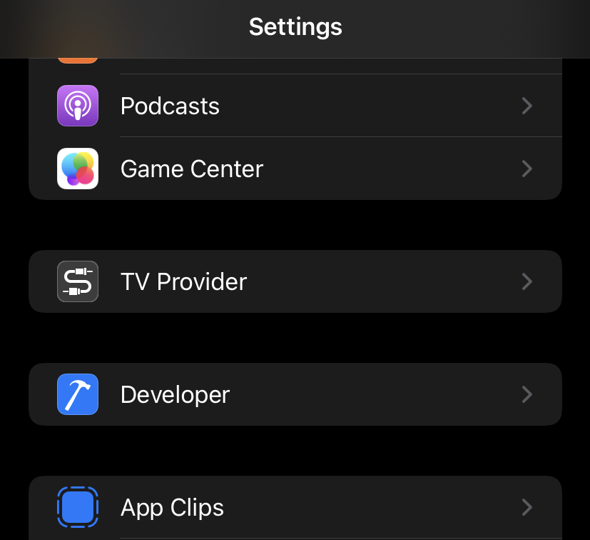
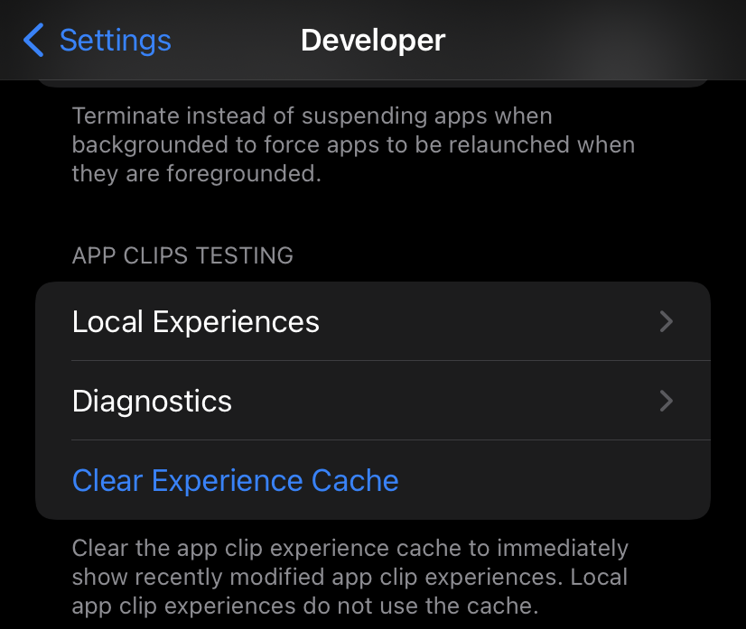
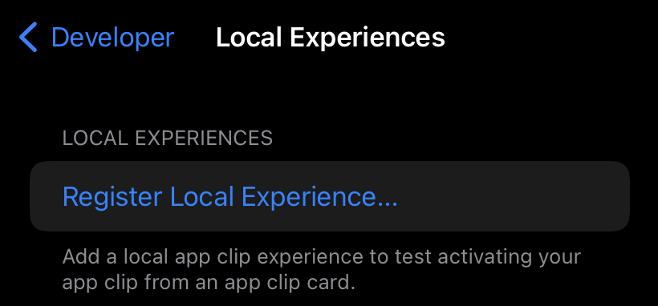
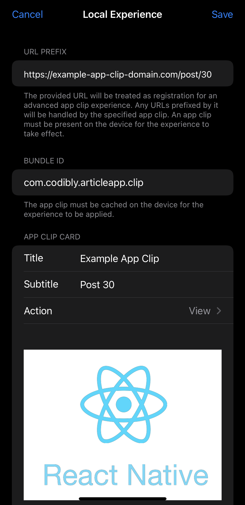

# Testing App Clip Launch Experience

Apple provided special options in iOS settings for testing App Clips with different URLs. We need to have our App Clip downloaded on our device - we can do that by connecting the iPhone to the **Xcode**. Then we can configure our phone to launch our App Clip when it is triggered by the chosen URL. Let’s set up our testing environment to test if our `AppClipLinkingManager` native module works properly:

First, we need to connect our device to **Xcode** - additional “**Developer**” options should be shown in device settings.

Open the “**Developer**” menu and find the App Clip Testing section.

Choose **Local Experiences**.

Select the **Register Local Experience** option.

Here we can specify the URL that should open our App Clip. Let’s set a URL different to our initial one. In my case, I’ve set another post number:

`https://example-app-clip-domain.com/post/30`

The next important field is **Bundle ID** - it has to be the same value as the **Bundle Identifier of the App Clip** target. Thanks to that, the field device will know which app should be launched.

The last required fields are the **Title** and **Subtitle** text fields. They will be shown on the **App Clip card**.

Optionally, we can change the Action button label to “**View**” or “**Play**” instead of “**Open**” and set-up the background image for the App Clip card. The same settings can be set on **AppStoreConnect** App Clip Card Configuration, Local Experiences settings are applied only to the local environment.

Save your new **Local Experience**. Now we can test it. The easiest way to test the invocation process is to scan a QR code with the URL provided in the newly registered Local Experience. Generate QR codes with sites like [📷 QR.io](https://qr.io/) and scan codes with the pre-installed **Code Scanner** iOS app - I recommend it instead of the Camera App that often ignores the Local Experiences Developer settings, but if your iPhone does not have the Code Scanner app pre-installed, use the **Camera App** instead.

Alright, let’s run our App Clip, minimise it, and scan the code with a different URL than the initial one.

Our `onNewUrl` event works!

**TIP: If Local Experiences configuration do not work, run "Clear Experience Cache" under App Clip Testing.**